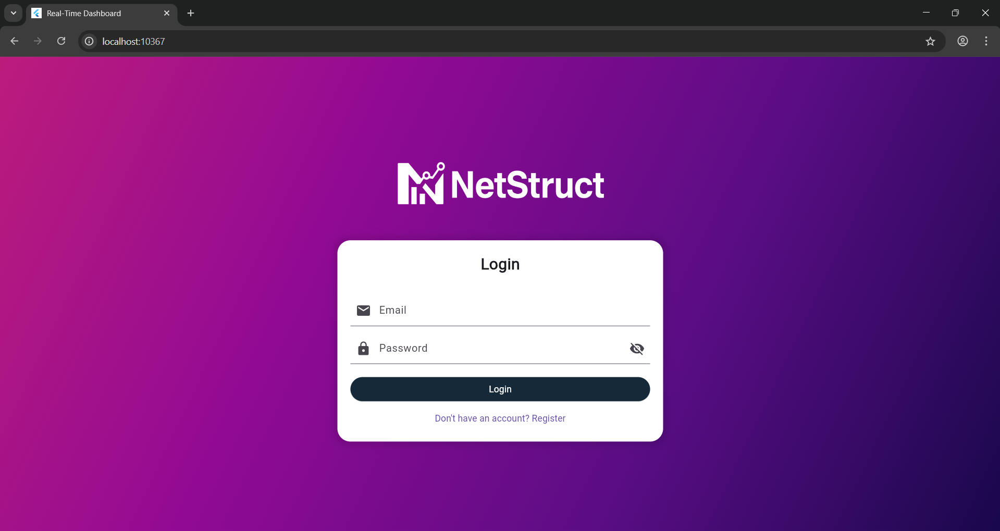
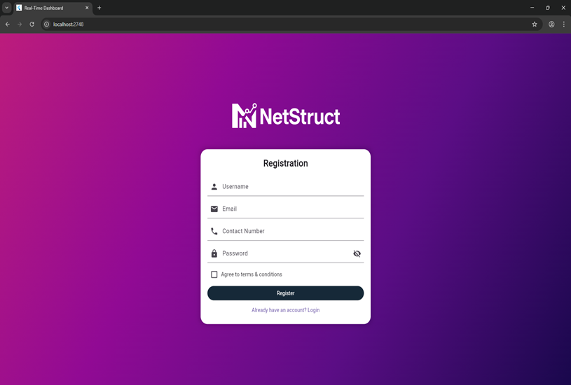
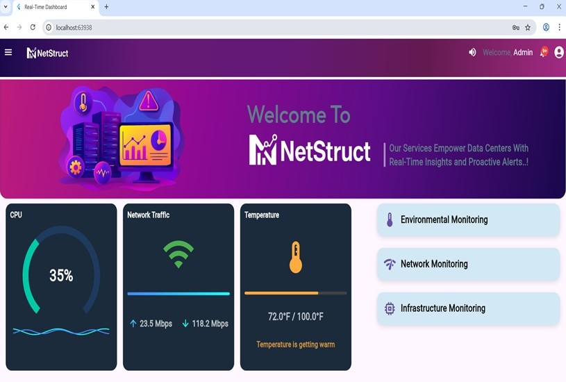
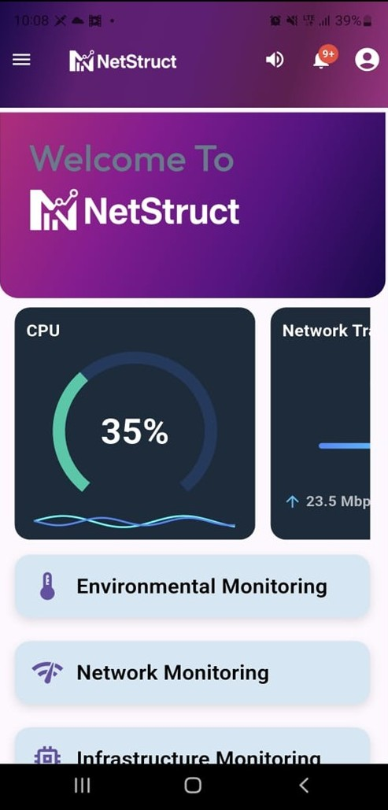

# NetStruct DataCenter Network Infrastructure Monitoring


A comprehensive **DataCenter Network Infrastructure Monitoring** application built with Flutter. This project provides real-time monitoring, alerting, and visualization of network infrastructure components in data center environments.

## 📱 Screenshots

<p align="center">
  
  
  
  
</p>

<p align="center">
  <em>Login • Register • Dashboard • Mobile-view</em>
</p>


## ✨ Features

- 🔍 **Real-time Network Monitoring** - Track bandwidth, latency, and packet loss
- 📊 **Interactive Dashboards** - Visualize network performance metrics
- ⚠️ **Intelligent Alerts** - Get notified of anomalies and outages
- 🗺️ **Network Topology Mapping** - Visual representation of infrastructure
- 📈 **Historical Analytics** - Trend analysis and reporting
- 🔐 **Secure Authentication** - Role-based access control
- 📱 **Responsive Design** - Works on mobile, tablet, and desktop
- 🌙 **Dark/Light Theme** - Customizable UI experience

## 🚀 Getting Started

### Prerequisites

- Flutter SDK (3.0 or higher)
- Dart SDK (3.0 or higher)
- Android Studio / VS Code
- Git

### Installation

1. **Clone the repository**
   ```bash
   git clone https://github.com/Chameera-10/NetStruct-DataCenter-Network-Monitoring.git
